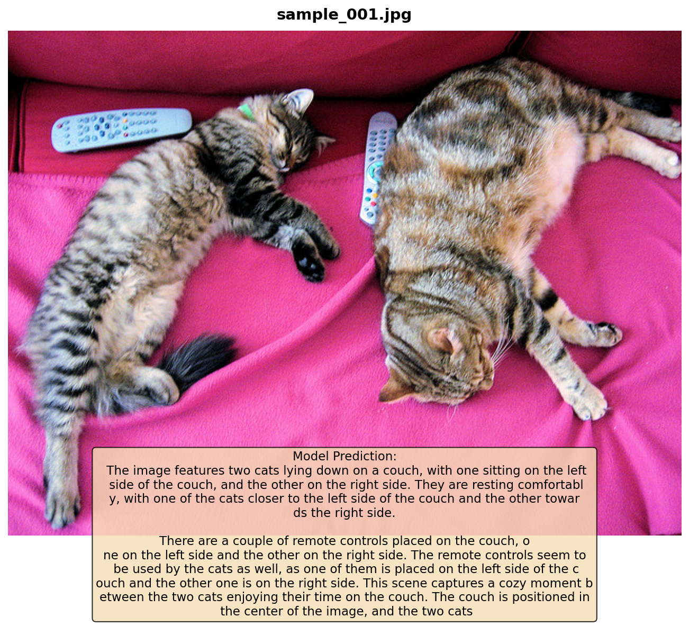
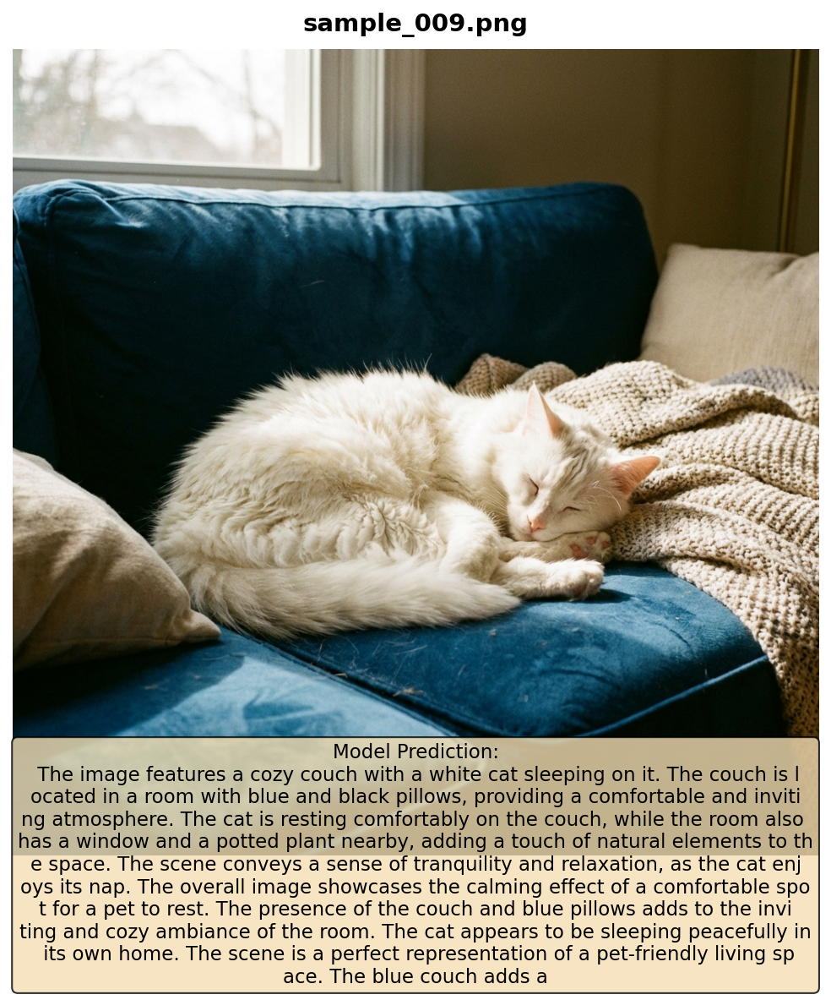
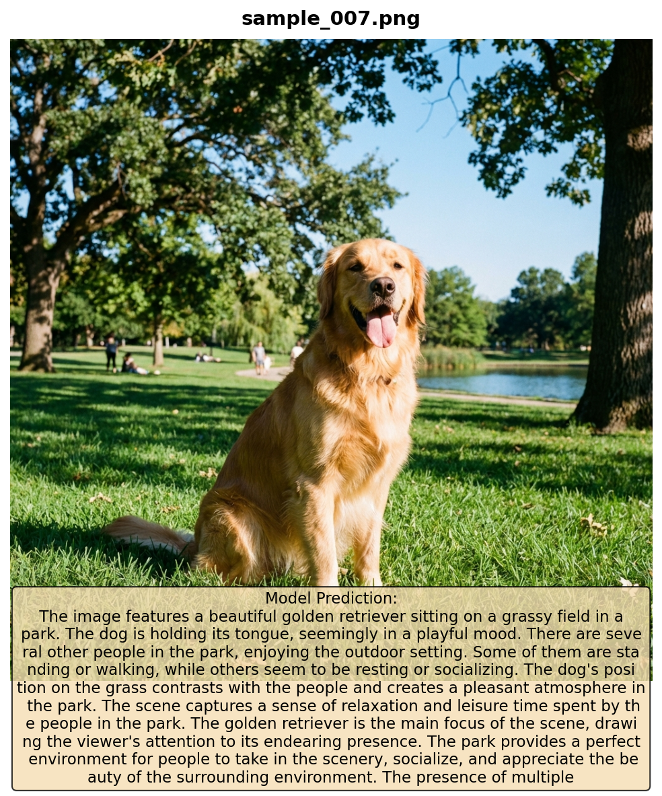
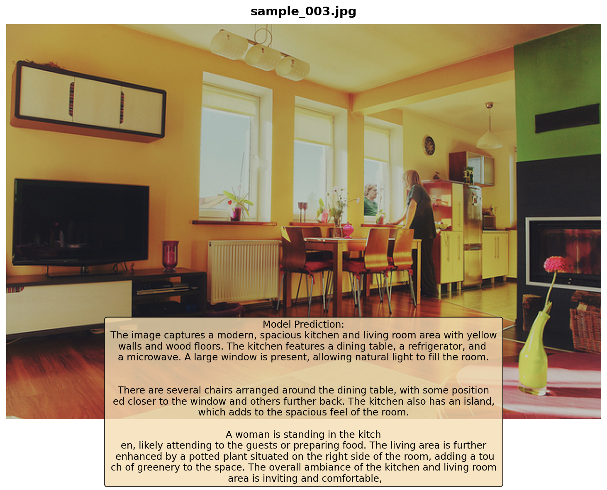
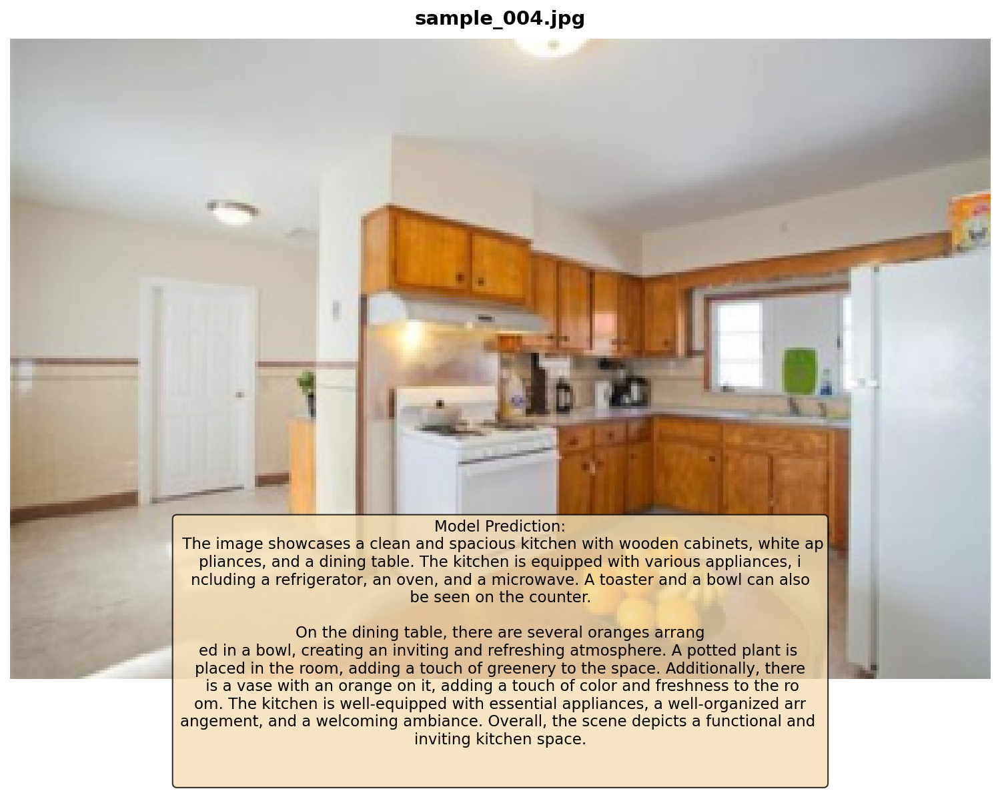
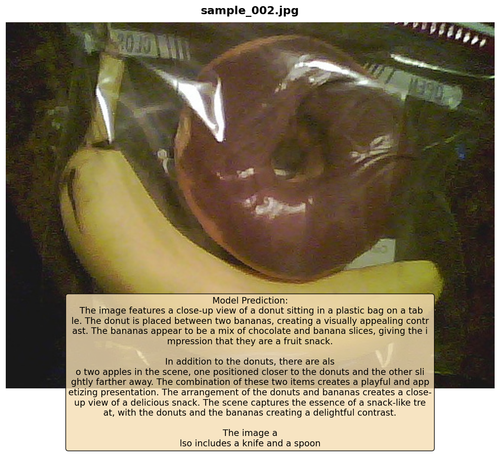
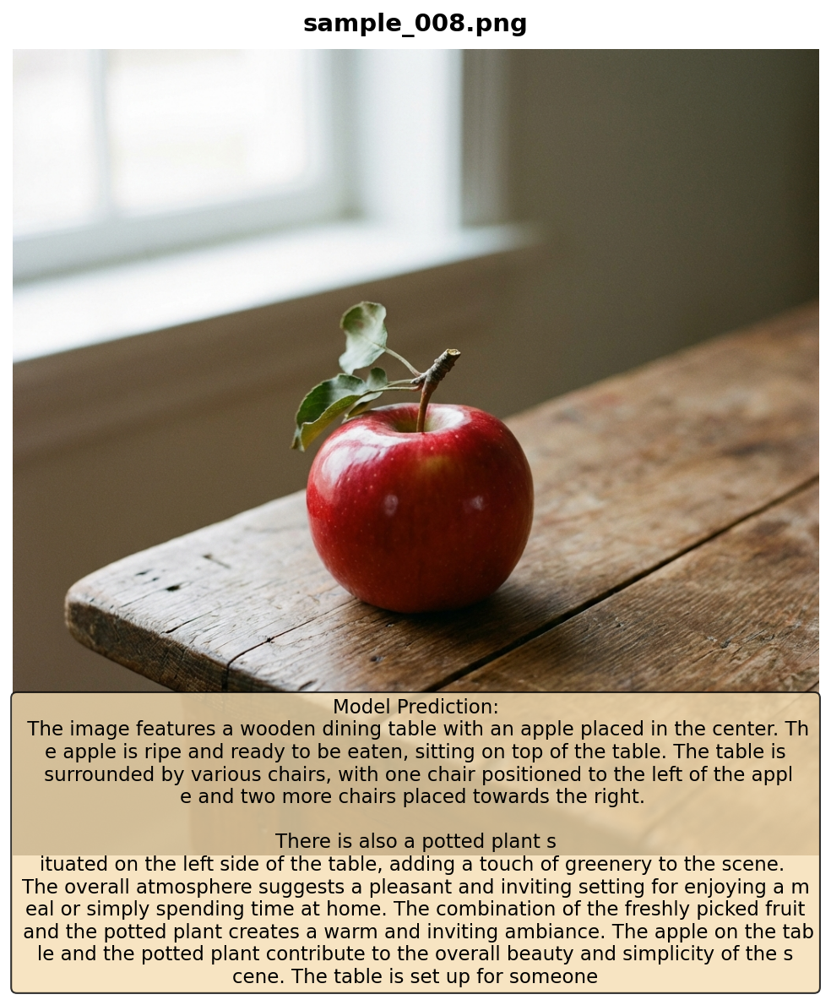
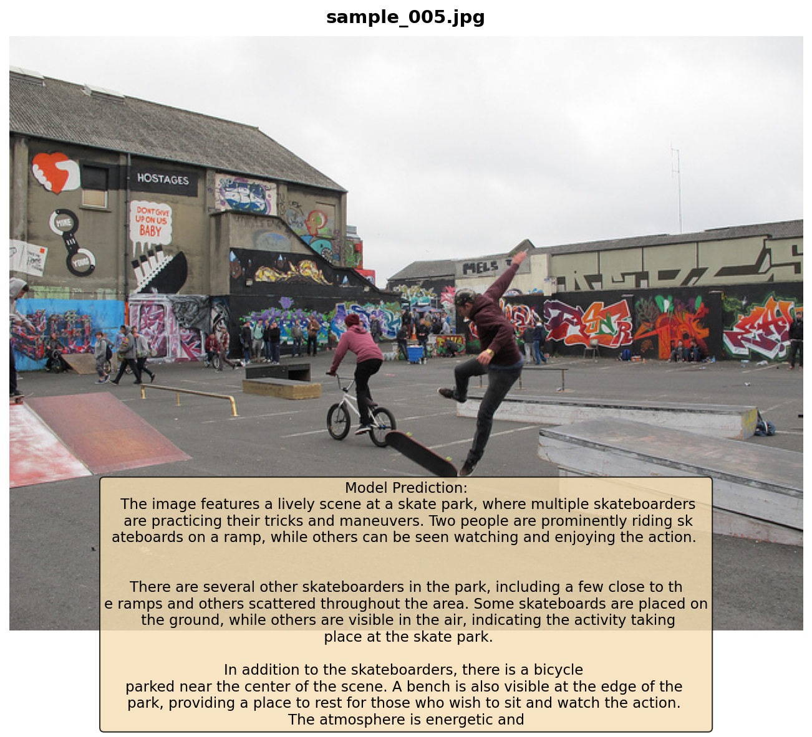
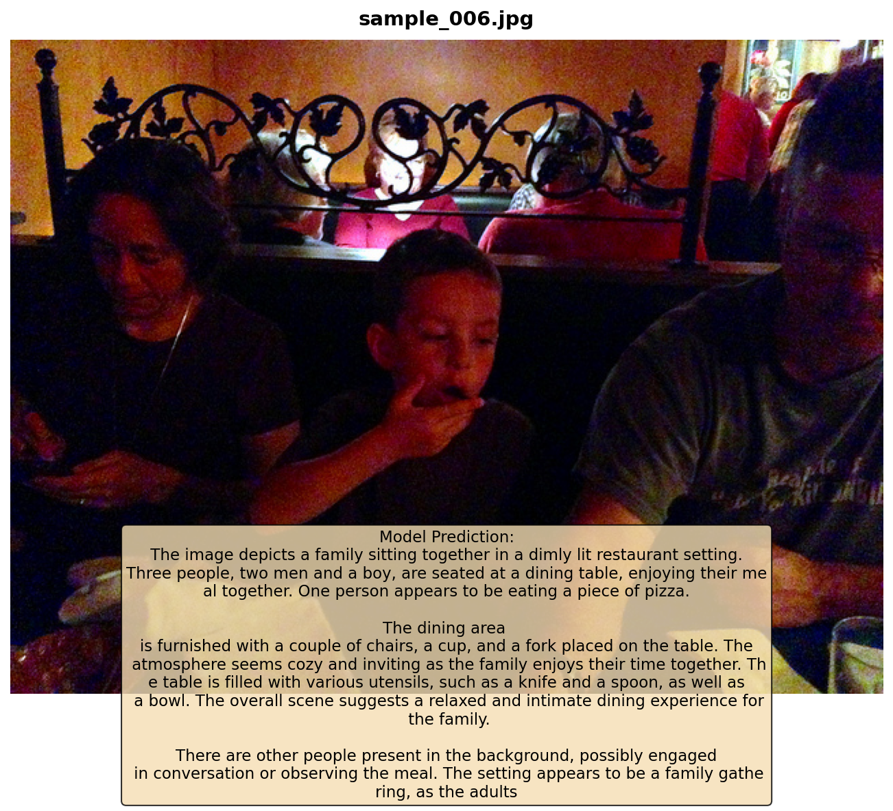

# Multimodal Gemma-270M MLOps Project

[](https://github.com/sagar431/multimodal-gemma-270m/actions/workflows/train_deploy.yml)
[](https://huggingface.co/spaces/sagar007/Multimodal-Gemma)
[](https://huggingface.co/sagar007/multimodal-gemma-270m-checkpoints)

A production-ready **Multimodal Vision-Language Model** built with PyTorch Lightning and automated MLOps CI/CD pipeline for deployment to HuggingFace Spaces.

## 🎯 Model Inference Examples

Here are real inference results from our trained model on test images:

### 🐱 Animal Detection
| Input Image | Model Output |
|-------------|--------------|
|  | *"The image features two cats lying down on a couch, with one sitting on the left side of the couch, and the other on the right side. They are resting comfortably..."* |
|  | *"The image features a cozy couch with a white cat sleeping on it. The couch is located in a room with blue and black pillows..."* |

### 🐕 Dog Recognition
| Input Image | Model Output |
|-------------|--------------|
|  | *"The image features a beautiful golden retriever sitting on a grassy field in a park. The dog is holding its tongue, seemingly in a playful mood..."* |

### 🏠 Room & Scene Understanding
| Input Image | Model Output |
|-------------|--------------|
|  | *"The image captures a modern, spacious kitchen and living room area with yellow walls and wood floors. The kitchen features a dining table, a refrigerator, and a microwave..."* |
|  | *"The image showcases a clean and spacious kitchen with wooden cabinets, white appliances, and a dining table. The kitchen is equipped with various appliances..."* |

### 🍕 Food & Objects
| Input Image | Model Output |
|-------------|--------------|
|  | *"The image features a close-up view of a donut sitting in a plastic bag on a table. The donut is placed between two bananas..."* |
|  | *"The image features a wooden dining table with an apple placed in the center. The apple is ripe and ready to be eaten..."* |

### 🛹 Activity Detection
| Input Image | Model Output |
|-------------|--------------|
|  | *"The image features a lively scene at a skate park, where multiple skateboarders are practicing their tricks and maneuvers..."* |

### 👨‍👩‍👦 People & Social Scenes
| Input Image | Model Output |
|-------------|--------------|
|  | *"The image depicts a family sitting together in a dimly lit restaurant setting. Three people, two men and a boy, are seated at a dining table..."* |

---

## 📊 Benchmark Results

Evaluation on local test images (9 samples):

| Benchmark | Score | Details |
|-----------|-------|---------|
| **Basic VQA** | **53.8%** | 7/13 questions correct |
| **POPE Hallucination** | **20.0%** | Yes-bias issue (common in small models) |

### VQA Performance Breakdown

| Task | Accuracy | Notes |
|------|----------|-------|
| Animal identification | ✅ High | Cat/dog detection works well |
| Room identification | ✅ Good | Kitchen, living room |
| Object presence (yes/no with context) | ✅ Good | "Is there a cat?" |
| Color identification | ⚠️ Moderate | Sometimes misses |
| Detailed attributes | ⚠️ Weak | Needs more training |

---

## 🚀 Training Configuration

| Parameter | Value |
|-----------|-------|
| Base Model | google/gemma-3-270m |
| Vision Encoder | openai/clip-vit-large-patch14 |
| **Training Samples** | **157,712 (Full LLaVA dataset)** |
| **Epochs** | **3** |
| Total Parameters | 539M |
| Trainable Parameters | 18.6M (3.4% of total) |
| GPU | NVIDIA A100 40GB |
| **Training Time** | **~9 hours** |
| **Final Training Loss** | **1.333** |
| **Final Validation Loss** | **1.430** |
| Batch Size | 20 |
| Effective Batch Size | 40 (with gradient accumulation) |
| Precision | bf16-mixed |

---

## 🖼️ Live Demo

### 🎮 [Click here to play with the Demo!](https://huggingface.co/spaces/sagar007/Multimodal-Gemma)

---

## 🌟 Features

- **Multimodal Architecture**: Combines Google Gemma-270M with CLIP vision encoder
- **PyTorch Lightning**: Clean, modular training code with automatic optimization
- **MLOps Pipeline**: Automated CI/CD with GitHub Actions
- **MLflow Integration**: Experiment tracking and model versioning
- **DVC Integration**: Data versioning and pipeline orchestration
- **Auto-Deployment**: Push to main → Test → Train → Deploy to HuggingFace Spaces
- **Gradio Interface**: Beautiful, interactive web UI for inference

---

## 📁 Project Structure

```
multimodal-gemma-270m/
├── .github/
│   └── workflows/
│       └── train_deploy.yml    # CI/CD pipeline
├── configs/
│   ├── config.yaml            # Main Hydra config
│   ├── model_config.yaml      # Model architecture
│   ├── training_config.yaml   # Training hyperparameters
│   └── data_config.yaml       # Dataset configuration
├── src/
│   ├── models/
│   │   ├── lightning_module.py   # PyTorch Lightning module
│   │   ├── multimodal_gemma.py   # Core model architecture
│   │   └── projectors.py         # Vision/Audio projectors
│   ├── data/
│   │   └── datamodule.py         # Lightning DataModule
│   ├── utils/
│   │   └── config.py             # Configuration utilities
│   └── trace_model.py            # Model export for deployment
├── hf_space/
│   ├── app.py                 # Gradio app for HuggingFace Spaces
│   ├── requirements.txt       # Space dependencies
│   └── README.md              # Space metadata
├── samples/
│   ├── test_images/           # Test images for evaluation
│   └── inference_results/     # Model predictions with visualizations
├── scripts/
│   ├── prepare_data.py        # Data preparation
│   └── validate_model.py      # Model validation
├── tests/
│   ├── test_model.py          # Model unit tests
│   └── test_app.py            # App tests
├── train.py                   # Main training script
├── inference.py               # Inference script
├── evaluate.py                # Benchmark evaluation
├── gradio_app.py              # Local Gradio app
├── dvc.yaml                   # DVC pipeline definition
├── pyproject.toml             # Project configuration
├── Dockerfile                 # Container definition
├── Makefile                   # Convenience commands
└── README.md                  # This file
```

---

## 🚀 Quick Start

### Installation

```bash
# Clone the repository
git clone https://github.com/sagar431/multimodal-gemma-270m.git
cd multimodal-gemma-270m

# Install dependencies with uv (recommended)
pip install uv
uv sync

# Or use pip
pip install -r requirements.txt
```

### Training

```bash
# Full training on 157K samples (recommended)
uv run python train.py \
  data.use_subset=false \
  training.max_epochs=3 \
  training.batch_size=20 \
  training.accumulate_grad_batches=2 \
  logging.use_mlflow=true

# Quick test run (50K samples)
uv run python train.py \
  data.use_subset=true \
  data.subset_size=50000 \
  training.max_epochs=1

# With Weights & Biases logging
uv run python train.py logging.use_wandb=true
```

### Inference

```bash
# Run inference on test images
uv run python inference.py \
  --checkpoint models/checkpoints/gemma-270m-llava-training/final_model.ckpt \
  --input-dir samples/test_images \
  --output-dir samples/inference_results
```

### Evaluation

```bash
# Run benchmark evaluation
uv run python evaluate.py models/checkpoints/gemma-270m-llava-training/final_model.ckpt
```

### Local Demo

```bash
# Run Gradio locally
uv run python gradio_app.py
# Open http://localhost:7860
```

---

## 🖥️ Lambda Labs GPU Guide

### GPU Selection for Training

| GPU | VRAM | Batch Size | Time (157K, 3 epochs) | Cost/hr | Recommended For |
|-----|------|------------|----------------------|---------|-----------------| 
| **A10** | 24 GB | 8-12 | ~15-18 hours | ~$0.75 | Budget training |
| **A100 (40GB)** | 40 GB | 16-20 | ~9 hours | ~$1.29 | **Best value** ✅ |
| **A100 (80GB)** | 80 GB | 24-32 | ~6-7 hours | ~$1.99 | Faster training |
| **H100** | 80 GB | 32-48 | ~4-5 hours | ~$2.49 | Production |

### Cost Estimation

| Training Run | GPU | Duration | Est. Cost |
|--------------|-----|----------|-----------|
| Quick test (50K, 1 epoch) | A10 | ~2 hr | ~$1.50 |
| **Full (157K, 3 epochs)** | **A100-40GB** | **~9 hr** | **~$11.61** ✅ |
| Full (157K, 3 epochs) | H100 | ~4 hr | ~$9.96 |

---

## 🔄 CI/CD Pipeline

The project uses GitHub Actions for automated MLOps:

```
Push to main → Tests → Train (optional) → Trace → Deploy to HuggingFace Spaces
```

### GitHub Secrets Required

| Secret | Description |
|--------|-------------|
| `HF_TOKEN` | HuggingFace API token with write access |
| `HF_USERNAME` | Your HuggingFace username |
| `WANDB_API_KEY` | (Optional) Weights & Biases API key |

---

## 🏗️ Architecture

### Model Components

- **Language Model**: Google Gemma-270M with LoRA adapters
- **Vision Encoder**: CLIP ViT-Large/14 (frozen)
- **Vision Projector**: MLP connecting vision to language
- **Training**: LLaVA-style multimodal instruction tuning

### Key Parameters

| Component | Size |
|-----------|------|
| Language Model | 270M parameters |
| Vision Encoder | 428M parameters (frozen) |
| Trainable (LoRA + Projector) | ~18.6M parameters |

---

## 📚 References

- [LLaVA Paper](https://arxiv.org/abs/2304.08485)
- [Gemma Technical Report](https://arxiv.org/abs/2403.08295)
- [PyTorch Lightning](https://lightning.ai/docs/pytorch/stable/)
- [HuggingFace Spaces](https://huggingface.co/docs/hub/spaces)

---

## 📄 License

Apache 2.0

---

## 🙏 Acknowledgments

- Google for Gemma models
- OpenAI for CLIP
- LLaVA team for multimodal architecture inspiration
- PyTorch Lightning team for the training framework