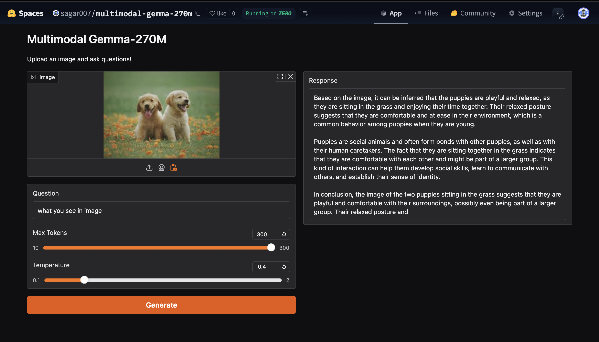

# Multimodal Gemma-270M MLOps Project

[](https://github.com/sagar431/multimodal-gemma-270m/actions/workflows/train_deploy.yml)
[](https://huggingface.co/spaces/sagar007/Multimodal-Gemma)
[](https://huggingface.co/sagar007/multimodal-gemma-270m-checkpoints)

A production-ready **Multimodal Vision-Language Model** built with PyTorch Lightning and automated MLOps CI/CD pipeline for deployment to HuggingFace Spaces.

## 🖼️ Live Demo



*Live interactive demo running on HuggingFace Spaces (ZeroGPU)*

### 🎮 [Click here to play with the Demo!](https://huggingface.co/spaces/sagar007/Multimodal-Gemma)

## 📊 Benchmark Results

Evaluation on local test images (9 samples):

| Benchmark | Score | Details |
|-----------|-------|---------|
| **Basic VQA** | **53.8%** | 7/13 questions correct |
| **POPE Hallucination** | **4.0%** | Yes-bias issue (common in small models) |

### VQA Performance Breakdown

| Task | Accuracy | Notes |
|------|----------|-------|
| Animal identification | ✅ High | Cat/dog detection works well |
| Room identification | ✅ Good | Kitchen, living room |
| Object presence (yes/no with context) | ✅ Good | "Is there a window?" |
| Color identification | ⚠️ Moderate | Sometimes misses |
| Detailed attributes | ⚠️ Weak | Needs more training |

### Training Configuration

| Parameter | Value |
|-----------|-------|
| Base Model | google/gemma-3-270m |
| Vision Encoder | openai/clip-vit-large-patch14 |
| Training Samples | 50,000 (LLaVA subset) |
| Epochs | 5 |
| Trainable Parameters | 7.6M (2.75% of total) |
| GPU | NVIDIA A100 40GB |
| Training Time | ~4 hours |

## 🌟 Features

- **Multimodal Architecture**: Combines Google Gemma-270M with CLIP vision encoder
- **PyTorch Lightning**: Clean, modular training code with automatic optimization
- **MLOps Pipeline**: Automated CI/CD with GitHub Actions
- **DVC Integration**: Data versioning and pipeline orchestration
- **Auto-Deployment**: Push to main → Test → Train → Deploy to HuggingFace Spaces
- **Gradio Interface**: Beautiful, interactive web UI for inference

## 📁 Project Structure

```
multimodal-gemma-270m/
├── .github/
│   └── workflows/
│       └── train_deploy.yml    # CI/CD pipeline
├── configs/
│   ├── config.yaml            # Main Hydra config
│   ├── model_config.yaml      # Model architecture
│   ├── training_config.yaml   # Training hyperparameters
│   └── data_config.yaml       # Dataset configuration
├── src/
│   ├── models/
│   │   ├── lightning_module.py   # PyTorch Lightning module
│   │   ├── multimodal_gemma.py   # Core model architecture
│   │   └── projectors.py         # Vision/Audio projectors
│   ├── data/
│   │   └── datamodule.py         # Lightning DataModule
│   ├── utils/
│   │   └── config.py             # Configuration utilities
│   └── trace_model.py            # Model export for deployment
├── hf_space/
│   ├── app.py                 # Gradio app for HuggingFace Spaces
│   ├── requirements.txt       # Space dependencies
│   └── README.md              # Space metadata
├── scripts/
│   ├── prepare_data.py        # Data preparation
│   └── validate_model.py      # Model validation
├── tests/
│   ├── test_model.py          # Model unit tests
│   └── test_app.py            # App tests
├── train.py                   # Main training script
├── gradio_app.py              # Local Gradio app
├── dvc.yaml                   # DVC pipeline definition
├── pyproject.toml             # Project configuration
├── Dockerfile                 # Container definition
├── Makefile                   # Convenience commands
└── README.md                  # This file
```

## 🚀 Quick Start

### Installation

```bash
# Clone the repository
git clone https://github.com/YOUR_USERNAME/multimodal-gemma-270m.git
cd multimodal-gemma-270m

# Install dependencies
pip install -r requirements.txt

# Or use make
make install
```

### Training

```bash
# Full training
python train.py

# Quick test run
python train.py trainer.fast_dev_run=true

# With Weights & Biases logging
python train.py logging.use_wandb=true

# Or use make
make train
make train-fast
```

### Model Export & Deployment

```bash
# Export model for deployment
python src/trace_model.py --output_path hf_space/model.pt

# Validate exported model
python scripts/validate_model.py --model_path hf_space/model.pt

# Or use make
make trace
make validate
```

### Local Inference

```bash
# Run Gradio locally
cd hf_space && python app.py

# Or use the full local app
python gradio_app.py
```

## 🔄 CI/CD Pipeline

The project uses GitHub Actions for automated MLOps:

```
Push to main → Tests → Train (optional) → Trace → Deploy to HuggingFace Spaces
```

### Pipeline Jobs

1. **Test**: Runs linting and unit tests
2. **Train**: Trains the model (manual trigger or on demand)
3. **Trace**: Exports model to deployment format
4. **Deploy**: Uploads to HuggingFace Spaces
5. **Integration Test**: Verifies deployed space

### GitHub Secrets Required

Set these in your repository settings:

| Secret | Description |
|--------|-------------|
| `HF_TOKEN` | HuggingFace API token with write access |
| `HF_USERNAME` | Your HuggingFace username |
| `WANDB_API_KEY` | (Optional) Weights & Biases API key |

### Manual Deployment

Trigger a deployment manually:

```bash
# Via GitHub CLI
gh workflow run train_deploy.yml

# With training
gh workflow run train_deploy.yml -f run_training=true -f max_epochs=5
```

## 📊 DVC Pipeline

Use DVC for reproducible ML pipelines:

```bash
# Run full pipeline
dvc repro

# Run specific stage
dvc repro train

# Visualize pipeline
dvc dag
```

### Pipeline Stages

```
prepare_data → train → trace → validate
```

## 🏗️ Architecture

### Model Components

- **Language Model**: Google Gemma-270M with LoRA adapters
- **Vision Encoder**: CLIP ViT-Large/14
- **Vision Projector**: MLP connecting vision to language
- **Training**: LLaVA-style multimodal instruction tuning

### Key Parameters

| Component | Size |
|-----------|------|
| Language Model | 270M parameters |
| Vision Encoder | 428M parameters |
| Trainable (LoRA + Projector) | ~18.6M parameters |

## 📝 Configuration

Modify configs via Hydra:

```bash
# Change model
python train.py model.gemma_model_name=google/gemma-2b

# Change training
python train.py training.max_epochs=10 training.projector_lr=1e-4

# Use different experiment
python train.py experiment=my_experiment
```

## 🖥️ Lambda Labs GPU Guide

### GPU Selection for Training

| GPU | VRAM | Batch Size | Time (50K, 3 epochs) | Cost/hr | Recommended For |
|-----|------|------------|----------------------|---------|-----------------|
| **A10** | 24 GB | 2-4 | ~4-5 hours | ~$0.75 | Budget training, testing |
| **A100 (40GB)** | 40 GB | 4-8 | ~2-3 hours | ~$1.29 | **Best value** |
| **A100 (80GB)** | 80 GB | 8-16 | ~1.5-2 hours | ~$1.99 | Faster training |
| **H100** | 80 GB | 16-32 | ~45min-1 hour | ~$2.49 | Production, large scale |

### Training Time Calculations

**Dataset: LLaVA-Instruct-150K**

| Subset Size | Steps/Epoch* | 3 Epochs | A100-40GB Time |
|-------------|--------------|----------|----------------|
| 10,000 | 312 | 936 | ~30-40 min |
| 50,000 | 1,562 | 4,687 | ~2-3 hours |
| 100,000 | 3,125 | 9,375 | ~4-5 hours |
| 150,000 (full) | 4,687 | 14,062 | ~6-8 hours |

*With effective batch size of 32 (batch_size=4 × accumulate_grad_batches=8)

### Quick Start Commands

```bash
# Subset training (50K samples, 3 epochs) - RECOMMENDED FOR TESTING
python train.py \
  data.use_subset=true \
  data.subset_size=50000 \
  training.max_epochs=3 \
  training.sample_every_n_steps=100 \
  logging.use_wandb=false

# Full dataset training (150K samples)
python train.py \
  data.use_subset=false \
  training.max_epochs=3 \
  logging.use_wandb=true

# Quick validation run (10K samples, 1 epoch)
python train.py \
  data.use_subset=true \
  data.subset_size=10000 \
  training.max_epochs=1 \
  training.sample_every_n_steps=50

# A10 GPU (lower memory) - reduce batch size
python train.py \
  data.use_subset=true \
  training.batch_size=2 \
  training.accumulate_grad_batches=16

# H100 GPU (more memory) - increase batch size
python train.py \
  data.use_subset=false \
  training.batch_size=8 \
  training.accumulate_grad_batches=4
```

### Lambda Labs Setup

```bash
# 1. SSH into your Lambda instance
ssh ubuntu@<your-lambda-ip>

# 2. Clone the repo
git clone https://github.com/YOUR_USERNAME/multimodal-gemma-270m.git
cd multimodal-gemma-270m

# 3. Create virtual environment
python -m venv .venv
source .venv/bin/activate

# 4. Install dependencies
pip install -r requirements.txt

# 5. Run training (50K subset example)
python train.py \
  data.use_subset=true \
  data.subset_size=50000 \
  training.max_epochs=3 \
  logging.use_wandb=false

# 6. Monitor GPU usage (in another terminal)
watch -n 1 nvidia-smi
```

### Memory Optimization Tips

If you run out of GPU memory:

```bash
# Reduce batch size
python train.py training.batch_size=2

# Enable gradient checkpointing (if supported)
python train.py training.gradient_checkpointing=true

# Use more aggressive quantization
python train.py model.use_4bit=true

# Reduce sequence length
python train.py data.max_length=64
```

### Cost Estimation

| Training Run | GPU | Duration | Est. Cost |
|--------------|-----|----------|-----------|
| Quick test (10K, 1 epoch) | A10 | ~15 min | ~$0.19 |
| Subset (50K, 3 epochs) | A100-40GB | ~2.5 hr | ~$3.22 |
| Full (150K, 3 epochs) | A100-40GB | ~7 hr | ~$9.03 |
| Full (150K, 3 epochs) | H100 | ~3 hr | ~$7.47 |

## 🧪 Testing & Evaluation

### Unit Tests

```bash
# Run all tests
pytest tests/ -v

# With coverage
pytest tests/ -v --cov=src --cov-report=html

# Or use make
make test
make test-cov
```

### Model Evaluation (Benchmarks)

```bash
# Run VQA and hallucination evaluation
cd multimodal-gemma-270m
source .venv/bin/activate
python evaluate.py

# With custom checkpoint
python evaluate.py path/to/your/checkpoint.ckpt
```

The evaluation script runs:
1. **Basic VQA**: Tests object/room identification, yes/no questions
2. **POPE-like Hallucination Test**: Checks if model hallucinates objects

### Inference on Custom Images

```bash
# Run inference on a folder of images
python inference.py \
  --checkpoint models/checkpoints/gemma-270m-llava-a100-optimized/final_model.ckpt \
  --input-dir samples/test_images \
  --output-dir samples/inference_results

# Local Gradio app for interactive testing
python app_local.py
# Then open http://localhost:7860
```

## 🐳 Docker

```bash
# Build image
docker build -t multimodal-gemma:latest .

# Train with GPU
docker run --gpus all -v $(pwd)/models:/app/models multimodal-gemma:latest

# Interactive shell
docker run --gpus all -it multimodal-gemma:latest bash
```

## 📚 References

- [LLaVA Paper](https://arxiv.org/abs/2304.08485)
- [Gemma Technical Report](https://arxiv.org/abs/2403.08295)
- [PyTorch Lightning](https://lightning.ai/docs/pytorch/stable/)
- [HuggingFace Spaces](https://huggingface.co/docs/hub/spaces)

## 📄 License

Apache 2.0

## 🙏 Acknowledgments

- Google for Gemma models
- OpenAI for CLIP
- LLaVA team for multimodal architecture inspiration
- PyTorch Lightning team for the training framework